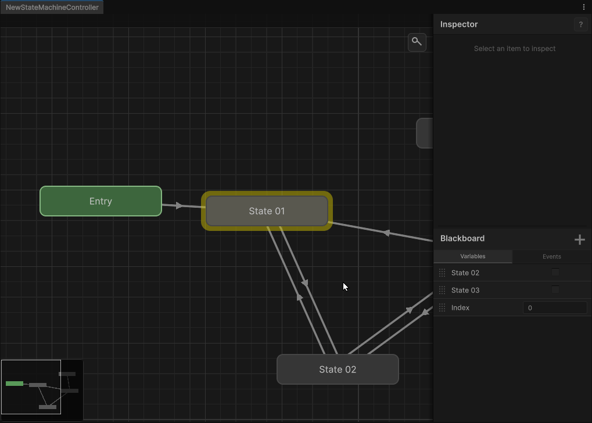

# Clean State Machine

A clean, extensible state machine system for Unity with a built-in visual graph editor. Design, visualize, and run state machines entirely inside the Unity Editor with no external dependencies.




---

## Features

- **Visual Graph Editor** — full-featured editor window with pan, zoom, node creation, connections, and groups
- **Runtime Execution** — lightweight `StateMachineComponent` MonoBehaviour that runs your graph
- **Blackboard System** — typed variables (Bool, Int, Float, String, Vector2, Vector3) shared across behaviours and conditions
- **Blackboard Variable References** — bind behaviour/condition parameters to blackboard variables or use direct values, no wiring needed
- **State Behaviours** — extend `StateBehaviour` to run custom logic on enter, update, and exit
- **Conditions** — extend `ConditionScript` to define custom transition logic
- **Undo / Redo** — full undo/redo support for all graph edits
- **Play-Mode Visualization** — active state and connection highlighting while running in the Editor
- **Groups** — organize states with coloured, resizable comment groups
- **Copy / Paste** — duplicate states with all connections and group membership
- **Customizable** — extend the context menu via `IContextMenuProvider`

---

## Installation

1. Open the Unity Package Manager (`Window > Package Manager`)
2. Click the **+** button and select **Add package from git URL...**
3. Enter the following URL:

   ```
   https://github.com/mhzeGit/UnityStateMachineTool.git?path=Packages/com.cleanstatemachine
   ```

Or add it as a dependency in your `Packages/manifest.json`:

```json
{
  "dependencies": {
    "com.cleanstatemachine": "https://github.com/mhzeGit/UnityStateMachineTool.git?path=Packages/com.cleanstatemachine"
  }
}
```

**Requirements**: Unity 6000.0 or newer.

---

## Quick Start

### 1. Create a Controller

In the Project window, right-click and select **Create > Clean State Machine > State Machine Controller**. This creates a `StateMachineController` asset.

### 2. Open the Graph Editor

Double-click the controller asset, or go to **Tools > Clean State Machine** to open the editor window and load it.

### 3. Build Your Graph

- **Right-click** on the canvas to create states
- The **Entry** state (green) is automatically created
- **Connect** states: select a state, press **C**, then click the target state
- **Drag** states to rearrange them
- **Double-click** a state name to rename it

### 4. Add Behaviours

Select a state in the editor and use the **Details Panel** on the right to assign a `StateBehaviour` script to it. The inspector shows all public fields on the behaviour for in-editor configuration.

### 5. Add Conditions

Select a connection to see its conditions in the Details Panel. Add condition entries and assign `ConditionScript` assets to define transition logic.

### 6. Run the Machine

1. Create a GameObject in your scene
2. Add the `StateMachineComponent` component
3. Drag your controller asset into the **Controller** field
4. Enter Play Mode — the state machine runs automatically, starting from the Entry state

---

## Core Concepts

### StateMachineController (ScriptableObject)

The graph asset. Stores all state data, connections, groups, and blackboard variables. Created as a `.asset` file in your project. One controller can be shared across multiple scene objects.

### StateMachineComponent (MonoBehaviour)

The runtime executor. Attach this to any GameObject to run a state machine. It copies the blackboard variables from the controller at initialization so runtime values are per-instance.

### StateBehaviour (ScriptableObject)

Abstract class for state logic. Override `OnStateEnter`, `OnStateUpdate`, and `OnStateExit`. Each state gets its own instance as a sub-asset of the controller.

```csharp
using UnityEngine;
using CleanStateMachine;

public class PatrolBehaviour : StateBehaviour
{
    public float speed = 2f;

    public override void OnStateEnter(StateMachineComponent stateMachine)
    {
        // Called once when entering this state
    }

    public override void OnStateUpdate(StateMachineComponent stateMachine)
    {
        // Called every frame while this state is active
    }

    public override void OnStateExit(StateMachineComponent stateMachine)
    {
        // Called once when leaving this state
    }
}
```

### ConditionScript (ScriptableObject)

Abstract class for transition conditions. Override `Evaluate` to return true/false. A connection's transition fires only when **all** its conditions evaluate to true.

```csharp
using UnityEngine;
using CleanStateMachine;

public class DistanceCondition : ConditionScript
{
    public float threshold = 10f;

    public override bool Evaluate(StateMachineComponent stateMachine)
    {
        float distance = Vector3.Distance(
            stateMachine.transform.position,
            GameObject.Find("Player").transform.position
        );
        return distance < threshold;
    }
}
```

### Blackboard

A collection of typed variables (Bool, Int, Float, String, Vector2, Vector3) that are shared across all states and conditions. Accessible from any `StateBehaviour` or `ConditionScript` at runtime via the `StateMachineComponent` reference.

### BlackboardVariableReference

A utility class for behaviour/condition fields that can either read a blackboard variable by name or use a direct default value. This keeps your scripts generic and reusable.

```csharp
public class DebugLogBehaviour : StateBehaviour
{
    public BlackboardVariableReference message = new()
    {
        ValueType = BlackboardVariableType.String,
        DefaultValue = "Hello World"
    };

    public override void OnStateEnter(StateMachineComponent stateMachine)
    {
        Debug.Log(message.GetStringValue(stateMachine));
    }
}
```

In the editor, each `BlackboardVariableReference` field shows a toggle to switch between **Direct Value** mode and **Blackboard Variable** mode with a dropdown to pick the variable name.

---

## Visual Editor Guide

| Action | Input |
|---|---|
| **Pan** | Right-click drag or middle-mouse drag |
| **Zoom** | Scroll wheel |
| **Create State** | Right-click canvas > Create State |
| **Connect States** | Select source state, press **C**, click target state |
| **Rename State** | Double-click state name |
| **Delete** | Select item(s) and press **Delete** or **Backspace** |
| **Select Multiple** | Ctrl+Click or drag selection box |
| **Copy / Paste** | Ctrl+C / Ctrl+V |
| **Group States** | Select states, Ctrl+G |
| **Ungroup** | Select group, right-click > Ungroup |
| **Resize Group** | Drag the bottom-right corner of a group |
| **Change Group Color** | Select group, use the color picker in the Details Panel |
| **Rename Group** | Double-click group header |
| **Save** | Ctrl+S (auto-saves on window close) |
| **Undo / Redo** | Ctrl+Z / Ctrl+Y |

The **Side Panel** (right side) contains:
- **Details Panel** (top) — inspect and edit the selected state, connection, or group
- **Blackboard Panel** (bottom) — add, remove, rename, and set default values for blackboard variables

---

## Creating Scripts

Use the **Assets > Create > Clean State Machine** menu to create new `StateBehaviour` or `ConditionScript` files from templates.

Alternatively, create scripts manually by extending `StateBehaviour` or `ConditionScript` in the `CleanStateMachine` namespace.

---

## Runtime API Reference

### StateMachineComponent

```csharp
// Blackboard variable access
void SetBoolParameter(string name, bool value);
void SetIntParameter(string name, int value);
void SetFloatParameter(string name, float value);
void SetStringParameter(string name, string value);
void SetVector2Parameter(string name, Vector2 value);
void SetVector3Parameter(string name, Vector3 value);

bool GetBoolParameter(string name);
int GetIntParameter(string name);
float GetFloatParameter(string name);
string GetStringParameter(string name);
Vector2 GetVector2Parameter(string name);
Vector3 GetVector3Parameter(string name);

// Control
void Initialize();
void ResetStateMachine();
```

### BlackboardVariableReference

```csharp
// All return either the blackboard value or the default value
string GetStringValue(StateMachineComponent stateMachine);
bool GetBoolValue(StateMachineComponent stateMachine);
int GetIntValue(StateMachineComponent stateMachine);
float GetFloatValue(StateMachineComponent stateMachine);
Vector2 GetVector2Value(StateMachineComponent stateMachine);
Vector3 GetVector3Value(StateMachineComponent stateMachine);
```

---

## Extending the Editor

Implement `IContextMenuProvider` to add custom items to the graph editor's right-click menu:

```csharp
using CleanStateMachine;

public class MyMenuProvider : IContextMenuProvider
{
    public void AddItemsToMenu(ContextMenuBuilder builder)
    {
        builder.AddItem("My Custom Action", () => Debug.Log("Custom!"));
    }
}
```

---

## License

MIT
